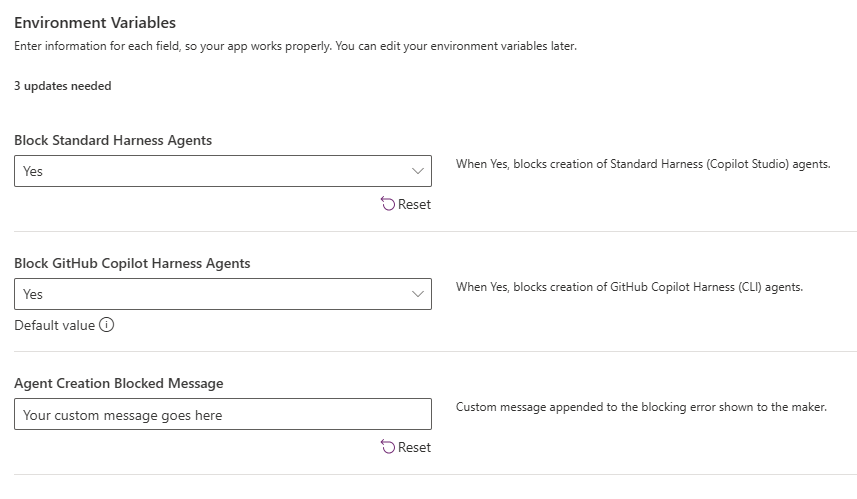
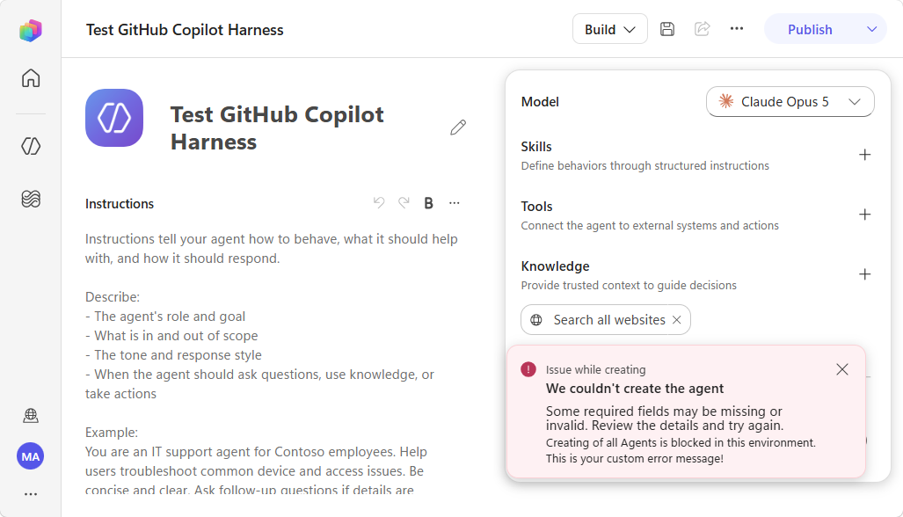
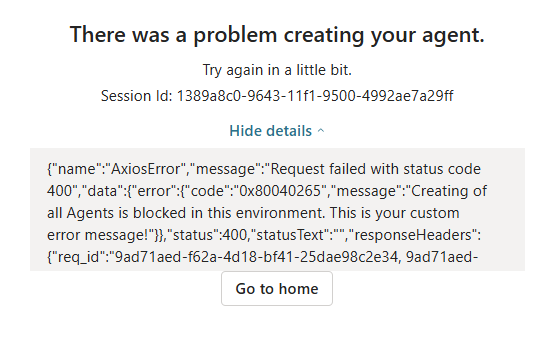

# CPS Agent Creation Blocker

A Dataverse plug-in that controls whether makers can create Copilot Studio agents in an environment. It can independently block:

- Standard Harness agents
- GitHub Copilot Harness agents, identified by a `bot.template` value beginning with `cliagent`

The plug-in runs synchronously during `PreValidation` of `Create` on the `bot` table, so blocked agents are rejected before they are created.

## Prerequisites

- System Administrator permissions in the target environment (specififcally check for )

## Install the managed solution

1. Download or obtain the managed solution ZIP from [`solution`](solution).
2. Open the [Power Apps maker portal](https://make.powerapps.com) and select the target environment.
3. Go to **Solutions**, select **Import solution**, and upload the ZIP.
4. Publish all customizations after the import completes.
5. Configure the environment variable values described below.

## Configuration

Set current values for these environment variables in the imported or registered solution:

| Environment variable | Default | Purpose |
| --- | --- | --- |
| `cpsb_BlockStandardHarnessAgents` | `false` | Blocks Standard Harness agent creation when enabled. |
| `cpsb_BlockGitHubCopilotHarnessAgents` | `false` | Blocks GitHub Copilot Harness agent creation when enabled. |
| `cpsb_AgentCreationBlockedMessage` | Contact-administrator message | Appends custom guidance to the error shown to the maker. |

Both blocking settings default to `false`; importing or registering the solution does not block agent creation until at least one is enabled.

## Test Screenshots

When trying to save a "GitHub Copilot Harness" Agent for the first time this will be the error and the agent will not be saved.

When trying to create a "Standard Harness" Agent the creation process is blocked and this message will be displayed (need to expand to see the custom error)

## Repository layout

- `src/CPSBlocker.Plugin` - Dataverse plug-in source
- `tools/RegisterPlugin` - development registration utility
- `solution` - destination for the exported managed solution ZIP